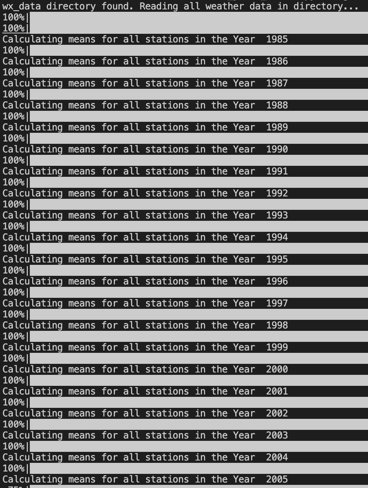
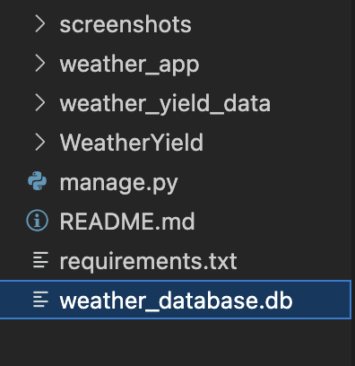
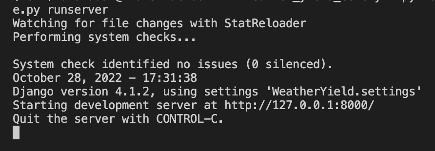
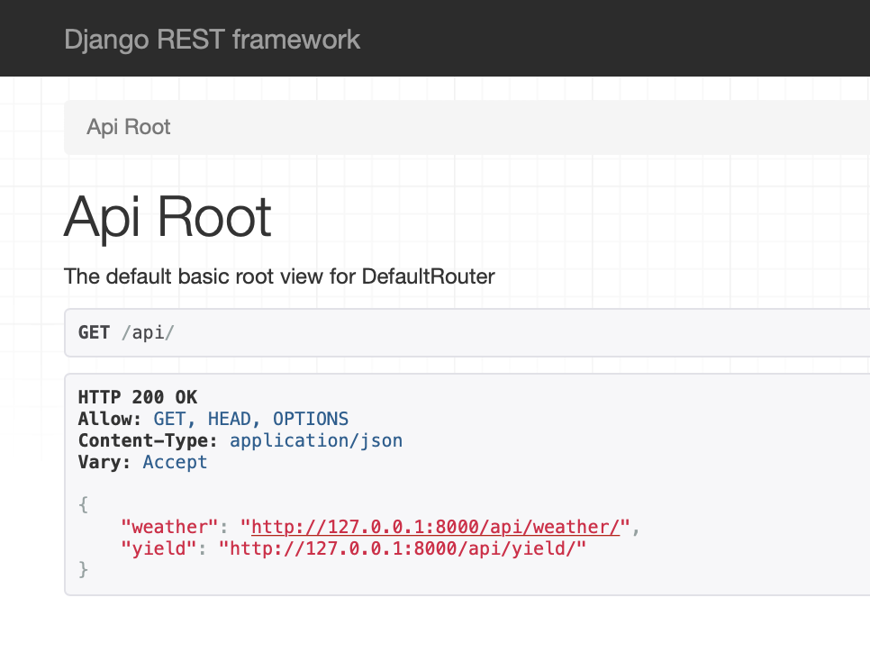
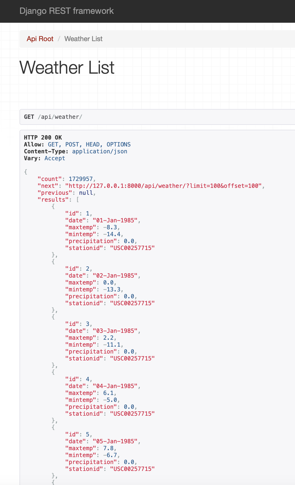
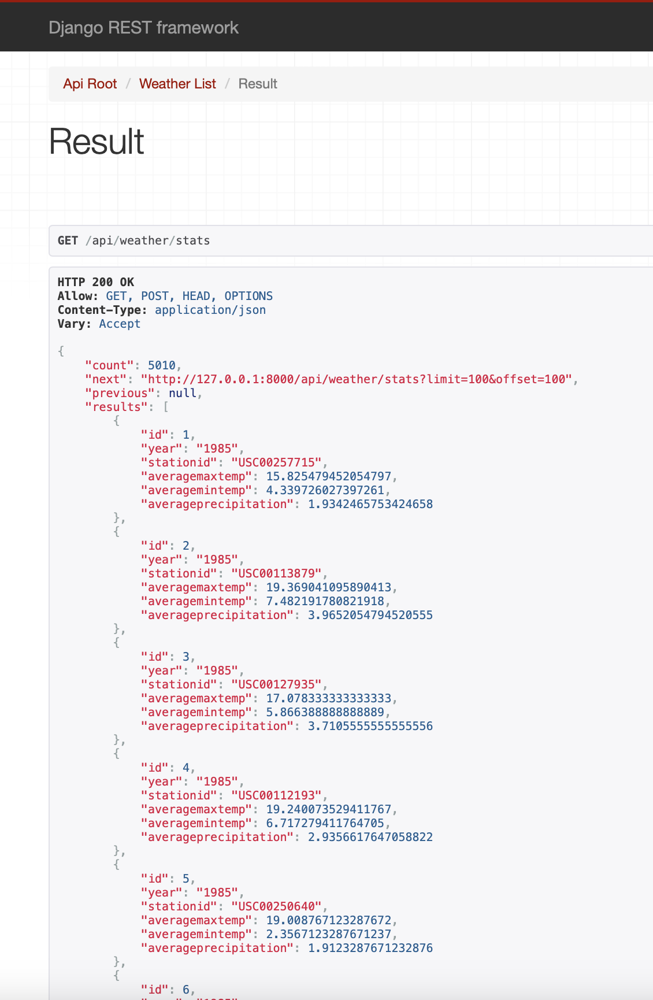
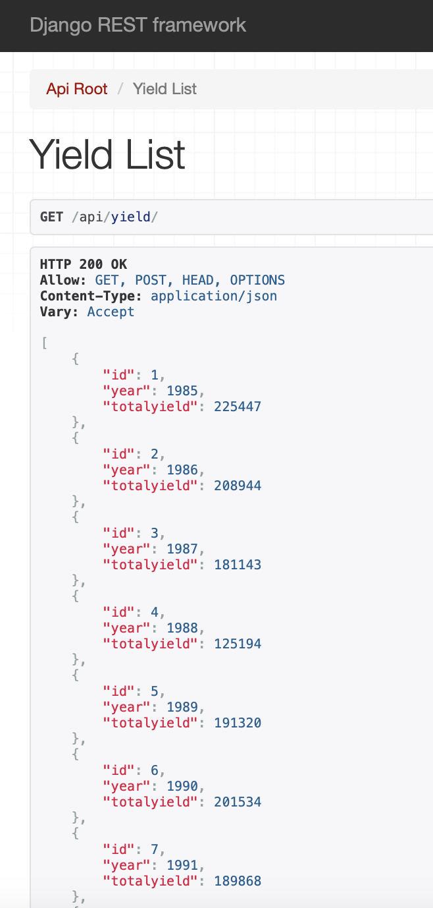

# Description
- Python automation to ingest data into SQLite database
- Ability to analyze data and create new data model from Data Analysis
- Used Django and Djangorestframework for implementation
- Rest api's to show all models data with some added filters
- Log file for error handling exceptions
- Used django custom command for ingestion of data into database(sqlite)
- Authenticated users and admin can do CRUD operations in all models through api's.
- default parameters for pages

  ```
  DEFAULT_PAGE = 1
  DEFAULT_PAGE_LIMIT = 100
  ```

# Installation
- Developed and tested the application on `MacOS` with `Python 3.10.12`
- Pre-requisites: _Any version of Python 3.x.x with python package manager pip_
- Upon successful installation of python, open command prompt/terminal on project directory and type
    ```shell
    pip install -r requirements.txt
    ```
    This installs all pre-requisite modules on your machine.

## File layout
- [generate_weatherdb.py](generate_weatherdb.py) - script responsible for populating Weather ,Yield and Results data sets.
  While populating Results, it takes the Weather stats table and it splits the average minimum, maximum temperatures and total precipitation data and stores it in `result` table. 

- [views.py](views.py) - This has all the API View classes which have inherited django backend filters

- [serializers.py](serializers.py) - This file converts the model data into a json format to use in the API view format

- [urls.py](urls.py) - In this have used routers for the routing of the view functions
    - `/api/weather`
    - `/api/weather/stats`
    - `/api/yield`

- [models.py](models.py) - Contains all the three data models Weather, Results & Yield

- [mycommands.py](mycommands.py) - Contains a custom handle funtion to run the models_data.py file funtions for ingestion of the data into DB

- [admin.py](admin.py) - This is a default admin file in which have registered all the three models so a user or admin can directly do CRUD 
  operations through admin page 

# Generating the parent Weather and Yield Database
- **weather_yield_data/generate_weatherdb.py** : Creates `weather_database.db` in the project root directory for Django App with 3 tables using weather and yield data from `wx_data` and `yld_data` directory respectively: 
    - `Weather`: Table containing daily weather data for each StationID (precipitation, maximum and minimum temperatures)
    - `Yield`: Table containing year and the respective annual crop yield.
    - `Result`: Table containing the weather stats like the annual average rainfall, average maximum and minimum temperatures ignoring the entries containing -9999.

- Change directory to `weather_yield_data` and run `generate_weatherdb.py` to generate weather yield database by typing:
    ```shell
    python generate_weatherdb.py
    ```
    You should be able to see the progress as shown in the screenshot below:
    

    Upon completion, you should be able to see the database in the root directory as shown in the screenshot below:
    
    **Note:** *This Process takes a long time (~ 1-2 hour(s)) due to the amount of data present in wx_data and yld_data directories*

- In cmd/terminal start django server by traversing back to the project root directory and type:
    ```shell
    python manage.py runserver
    ```
    this will start the django server at port 8000
    

## Problem Statement 1 -> Data Modeling
- **Weather Data**
: Each StationID text file (under wx_data) contains its respective annual precipitation, maximum and minimum temperatures. All data entries are tab separated. Hence, `pandas` is used for quick parsing. Using Pandas, the data is converted into data frames and a column is added to indicate which StationID the data corresponds to. ID column added to use it as a Primary Key. The dataframe conversion is handled using the function `create_weather_df()` defined in `generate_weatherdb.py`.

- **Yield Data** 
: Similar to weather data parsing, the yield data is also parsed using pandas by converting the data into a dataframe which is handled using the function `create_yield_df()` defined in `utils.py`.

## Problem Statement 2 -> Ingestion
: Using `sqlite3` and `pandas` modules the weather and yield data frames are converted to respective weather and yield tables in the newly created weather_yield.db file. This is achieved using `create_weather_table()` and `create_yield_table()` functions defined in `generate_weatherdb.py`.

## Problem Statement 3 -> Data Analysis
: Since the weather data is already made available in the form of a dataframe, `Pandas` is used to perform data analysis.
For every year and every Station ID, the average annual precipitation, annual average maximum and minimum temperatures are computed and stored in a new resultant data frame.
All entries containing -9999 are ignored for any calculations.
Upon storing the resultant data in the form of a dataframe, `pandas` and `sqlite3` modules are used again for creating the `result` table in `weather_database.db` which holds the computed weather data. All the data are stored with respective Year, StationID columns.

## Problem Statement 4 -> API

: Implemented 3 endpoints with Django filters and Django Rest Framework
### Routes:
- `/api/weather`
    - Filterset Fields
        - date, stationid, id
    - Screeshot for list view:
    
    
- `/api/weather/stats`
    - Filterset Fields
        - year, stationid
    - Screeshot for list view:
    
    
- `/api/yield`
    - Filterset Fields
        - year
    - Screeshot for list view:
    
    


## Sample linter run

```
pylint models.py

-------------------------------------------------------------------
Your code has been rated at 10.00/10 (previous run: 9.38/10, +0.62)
```

## Sample code formatter run

```
black .
All done! ✨ 🍰 ✨
17 files left unchanged.
```

## Sample coverage test run

```
weatherAPI % python manage.py test
Found 3 test(s).
Creating test database for alias 'default'...
System check identified no issues (0 silenced).
...
----------------------------------------------------------------------
Ran 3 tests in 0.009s

OK
Destroying test database for alias 'default'...
```
